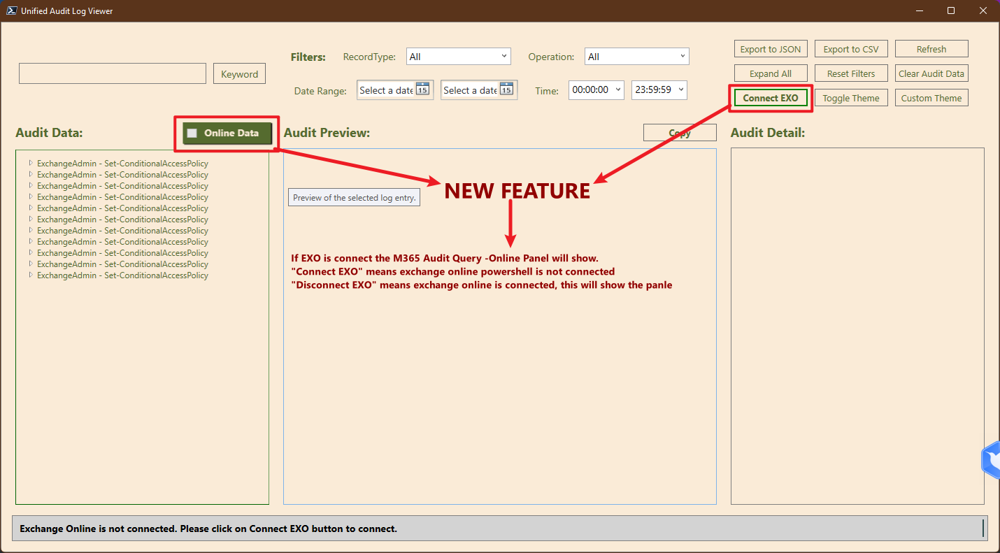
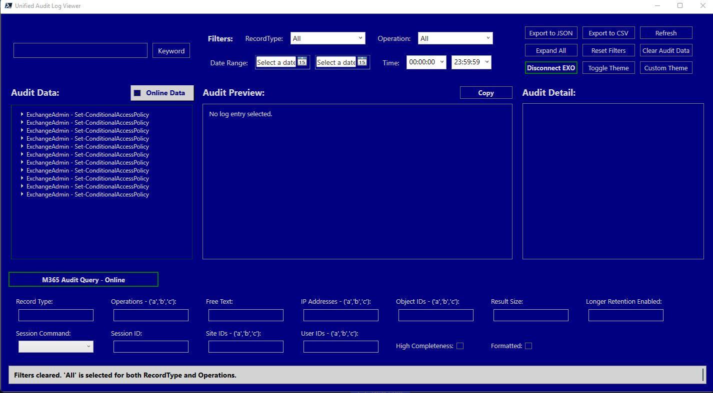

# Change Log - M365 Unified Audit Log Analyzer (GUI Version)

## Table of Contents

- [Version 2.0.0](#version-200)
  - [Release Date: 3/20/2025](#release-date-3202025)
  - [New Features](#new-features)
    - [M365 Audit Query - Online Panel](#1-m365-audit-query---online-panel)
    - [Online Data Toggle](#2-online-data-toggle)
    - [Connect/Disconnect EXO](#3-connectdisconnect-exo)
  - [Screenshots](#screeshots)
  - [Updated Features](#updated-features)
    - [Toggle Theme and Custom Theme](#toggle-theme-and-custom-theme)
  - [Bug Fixes](#bug-fixes)
  - [Known Issues](#known-issues)
  - [Future Enhancements](#future-enhancements)
  - [Contributors](#contributors)
  - [Feedback and Support](#feedback-and-support)

---

## Version 2.0.0

### Release Date: 3/20/2025

---

### New Features

#### 1. **M365 Audit Query - Online Panel**

- **Description**:

  - A new **Online Panel** has been added to enable direct unified audit log searches and analysis within the tool.
  - The start and end date/time are automatically retrieved from the filter panel.
  - All parameters from the `Search-UnifiedAuditLog` PowerShell cmdlet (as documented in the [Microsoft documentation](https://learn.microsoft.com/en-us/powershell/module/exchange/search-unifiedauditlog?view=exchange-ps)) have been integrated into the panel.
  - This feature allows users to retrieve and analyze M365 audit logs directly without needing to use the Microsoft 365 portal.

- **Benefits**:
  - Fine-tune your audit log searches with advanced parameters.
  - Streamline the process of retrieving and analyzing logs in one place.

#### 2. **Online Data Toggle**

- **Description**:
  - A new toggle has been added to enable or disable the **Online Data Retrieval Panel**.
  - If Exchange Online is connected, the panel will open automatically.
  - If Exchange Online is not connected, the panel will remain hidden.

- **Benefits**:
  - Provides flexibility to hide the online panel when not needed.
  - Improves usability by automatically adapting to the connection status.

#### 3. **Connect/Disconnect EXO**

- **Description**:
  - Added functionality to **Connect** or **Disconnect** from Exchange Online directly within the tool.
  - After connecting to Exchange Online, the **Online Panel** will open automatically.

- **Benefits**:
  - Simplifies the process of managing Exchange Online connections.
  - Enhances user experience by automating panel visibility based on connection status.

## Screeshots

{ width=65% }

{ width=65% }

---

### Updated Features

#### **Toggle Theme and Custom Theme**

- **Description**:
  - The **Theme Toggle** feature has been updated to include **10 pre-built themes**.
  
    | Light Mode           | Dark Mode           |
    |-----------------------|---------------------|
    | High Contrast         | Custom Navy Theme   |
    | Solarized Light       | Solarized Dark      |
    | Monokai               | Dracula             |
    | One Dark              | Gruvbox Light       |
  
  - Updated the **Custom Theme** option, allowing users to select their preferred colors for the interface.
  - Theme changes now apply to all elements in the user interface, improving readability and visual consistency.

- **Benefits**:
  - Provides more customization options for users.
  - Enhances readability and user experience across the application.

## Sample Blue Mode

{ width=65% }

---

### Bug Fixes

- Fixed an issue where the theme settings were not applying consistently across all UI elements.

---

### Known Issues

- Performance may be impacted when retrieving large volumes of audit logs online.
- Some users may experience delays when applying custom themes.

---

### Future Enhancements

- Allow multiple select in the "Audit Data" panel and expect only the selected
- Implement additional visualization options for audit log data.
- Improve performance for handling large datasets
- Add Email feature, to automatically package the select logs and email to some else.
- Check the [Feature Road Map](./FeatureRoadMap.md) for more information

---

### Contributors

- Daniel Tetteh (techjollof@gmail.com) - Project Lead

---

### Feedback and Support

For bug reports, feature requests, or general feedback, please open an issue on the [GitHub repository](https://github.com/techjollof/M365UnifiedAuditLogAnalyzer/issues) or reach me on my email