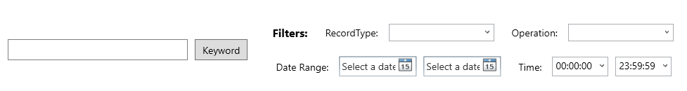
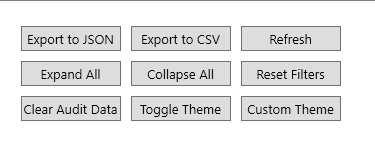

# Unified Audit Log Analyzer

## Overview

The **Unified Audit Log Analyzer** is a powerful PowerShell-based graphical user interface (GUI) tool designed to help administrators analyze and visualize Microsoft 365 (M365) Unified Audit Logs. This tool provides a user-friendly interface for loading, filtering, and exporting audit log data in various formats (CSV, JSON). It supports drag-and-drop functionality, advanced filtering, hierarchical data exploration, and customizable themes.

---

## Key Features

### ✅ Data Import from Multiple Sources

- **Supported Formats**: Import audit log data from CSV or JSON files.
- **Direct Input**: Load data by specifying a file path via the `-InputData` parameter.
- **Double-Click**: Double-click the TreeView area to open a file dialog and select a file.
- **Drag-and-Drop**: Drag and drop CSV or JSON files directly into the application for quick loading.

### ✅ Advanced Filtering

- **RecordType Filter**: Filter logs by specific record types (e.g., "FileAccessed", "UserLoggedIn").
- **Operations Filter**: Filter logs by specific operations (e.g., "FileDownload", "MailSent").
- **Date and Time Range**: Filter logs by specific date and time ranges.
- **Keyword Search**: Search for specific keywords within the log data.
- **Regular Expressions**: Use regular expressions for advanced search and filtering.
- **Bulk Actions**: Perform bulk filtering using checkboxes for RecordType and Operations.

### ✅ Data Preview

- **Preview Pane**: View a summary of the selected log entry without expanding it in the TreeView.
- **Copy Previewed Log**: Copy the content of the preview pane and paste it into other applications.

### ✅ Drag-and-Drop Support

- **Quick Loading**: Drag and drop CSV or JSON files into the application for quick and easy data loading.

### ✅ Search History

- **Search History**: Maintain a history of search terms and allow users to quickly reuse them.

### ✅ Custom Themes

- **User Color Picker**: Choose any color for the background and text.
- **Custom Theme Button**: Opens a color picker for background and text separately.
- **Apply Colors**: Applies custom colors to all UI elements, including buttons, labels, and more.
- **Preserve Default Themes**: Users can still cycle through predefined themes (light, dark, high contrast).

### ✅ Search Enhancements

- **Regular Expressions**: Add support for regular expressions in the search box for advanced filtering.
- **Highlight Search Results**: Highlight search results in the TreeView for better visibility.

### ✅ Export Selected Log Entry

- **Multiple Log Entry Selection**: Enable multiple log entry selection in the data view section for bulk export.

---

## Usage

### Prerequisites

1. **PowerShell**: Ensure PowerShell 5.1 or later is installed.
2. **WPF Assemblies**: The script uses Windows Presentation Foundation (WPF) for the GUI, which is included in .NET Framework.
3. **Permissions**: Ensure the account running the script has the necessary permissions to access the audit log data.

---

### Parameters

The script accepts the following parameter when run from the command line:

| Parameter    | Description                                                              | Example Value                |
| ------------ | ------------------------------------------------------------------------ | ---------------------------- |
| `-InputData` | Path to a CSV or JSON file containing audit log data, or in-memory data. | `"C:\AuditLogs\logdata.csv"` |

---

### Running the Script

1. **Download the Script**:
   - Download the [UnifiedAuditLogAnalyzer.ps1](https://github.com/techjollof/M365UnifiedAuditLogAnalyzer/blob/main/UnifiedAuditLogAnalyzer.ps1) script from the GitHub repository.

2. **Run the Script**:
   - Open PowerShell and navigate to the directory containing the script. There are two ways of run the program/script
  
   - Run the script using the following command without parameter
  
     ```powershell
     .\UnifiedAuditLogAnalyzer.ps1
     ```

   - Example command to load data via `InputData` parameter:

        - The parametric version can take full file path `"C:\AuditLogs\logdata.csv"` 

            ```powershell
            .\UnifiedAuditLogAnalyzer.ps1 -InputData "C:\AuditLogs\logdata.csv"
            ```

        - The parametric version can take full file path `"C:\AuditLogs\logdata.csv"`

            ```powershell
            $log = Import-csv  "C:\AuditLogs\logdata.csv"
            .\UnifiedAuditLogAnalyzer.ps1 -InputData $log
            ```

3. **Load Data**:
   - Drag and drop a CSV or JSON file containing audit log data into the application window.
   - Alternatively, double-click the TreeView area to open a file dialog and select a file.

4. **Filter Data**:
   - Use the filter options (RecordType, Operations, Date Range, Time Range, and Keyword Search) to narrow down the log entries.
   - Click the "Refresh" button to reload the data with the applied filters.

    

5. **Explore Data**:
   - Click on log entries in the "Audit Data" to view summarized information in the preview pane.
   - Double-click on entries to expand or collapse nested data.

6. **Export Data**:
   - Use the "Export to CSV" or "Export to JSON" buttons to save the filtered data to a file.

7. **Customize UI**:
   - Use the "Toggle Theme" button to switch between light and dark themes.
   - Use the "Custom Theme" button to pick custom colors for the UI.

    

---

### UI Components

1. **Audit Data**:
   - Displays the audit log data in a hierarchical structure.
   - Double-click to expand or collapse entries.

2. **Audit Preview**:
   - Displays a summary of the selected log entry.
   - Includes a "Copy" button to copy the preview text to the clipboard.

3. **Audit Detail**:
   - Displays detailed information about the selected log entry in JSON format.

4. **Filter Panel**:
   - Contains filters for RecordType, Operations, Date Range, Time Range, and Keyword Search.

5. **Status Bar**:
   - Displays status messages and progress information.

6. **Export Buttons**:
   - "Export to CSV": Exports filtered data to a CSV file.
   - "Export to JSON": Exports filtered data to a JSON file.

7. **Theme Buttons**:
   - "Toggle Theme": Switches between light and dark themes.
   - "Custom Theme": Allows custom color selection for the UI.
  
---


---

### Example Workflow

1. **Load Data**:
   - Drag and drop a CSV file containing audit logs into the application.

2. **Apply Filters**:
   - Select "FileAccessed" in the Operations filter.
   - Set a date range from "2023-01-01" to "2023-01-31".
   - Enter a keyword (e.g., "admin") in the search box.

3. **Explore Data**:
   - Click on log entries in the TreeView to view summaries in the preview pane.
   - Double-click to expand nested data.

4. **Export Data**:
   - Click "Export to CSV" to save the filtered data to a CSV file.

5. **Customize UI**:
   - Click "Toggle Theme" to switch to dark mode.
   - Use "Custom Theme" to pick custom colors for the UI.

---

## Troubleshooting

1. **File Not Found**:
   - Ensure the file path is correct and the file exists.
   - Use the drag-and-drop feature or file dialog to load the file.

2. **Invalid File Format**:
   - Ensure the file is in CSV or JSON format.
   - Check the file structure and ensure it matches the expected format.

3. **No Data Loaded**:
   - Verify that the file contains valid audit log data.
   - Check for errors in the status bar.

4. **UI Issues**:
   - Restart the application if the UI becomes unresponsive.
   - Ensure the script is running in a PowerShell environment with WPF support.

---

## Notes

- The script is designed for Microsoft 365 environments and requires audit log data in CSV or JSON format.
- Regularly update the script to ensure compatibility with the latest PowerShell and .NET Framework versions.

---

## License

This script is provided under the [MIT License](./License.md). 

---

## Contact

For additional support or feature requests

- please open an issue on the [GitHub repository](https://github.com/techjollof/M365UnifiedAuditLogAnalyzer).
- You can also reach me via techjollof@gmail.com. Follow me on [linkedIn](https://www.linkedin.com/in/ndtetteh/) 