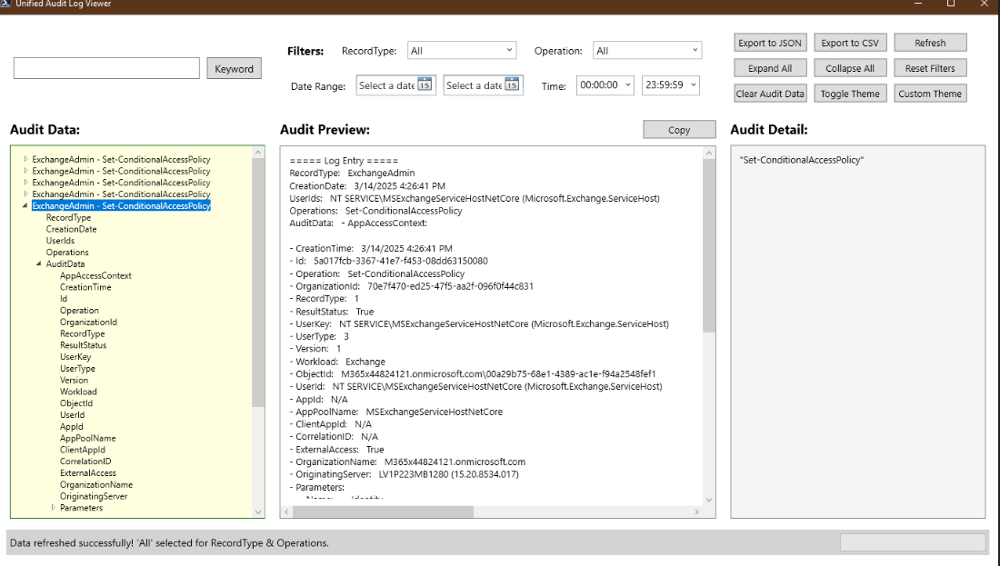

# Unified Audit Log Analyzer

## Table of Contents

- [Unified Audit Log Analyzer](#unified-audit-log-analyzer)
  - [Unified Audit Log Analyzer (GUI)](#unified-audit-log-analyzer-gui)
  - [Expand-UnifiedAuditLogReport (Non-GUI)](#expand-unifiedauditlogreport-non-gui)

## Unified Audit Log Analyzer (GUI) - Advanced Unified Audit Log Analyzer

The **Unified Audit Log Analyzer** is a powerful PowerShell-based graphical user interface (GUI) tool designed to help administrators analyze and visualize Microsoft 365 (M365) Unified Audit Logs. This tool provides a user-friendly interface for loading, filtering, and exporting audit log data in various formats (CSV, JSON). 

### Key features include:

- Drag-and-drop functionality
- Advanced filtering capabilities
- Hierarchical data exploration
- Customizable themes

### Notes and Requirements

1. **PowerShell**: Ensure PowerShell 5.1 or later is installed.
2. **WPF Assemblies**: The script uses Windows Presentation Foundation (WPF) for the GUI, which is included in .NET Framework.
3. **Permissions**: Ensure the account running the script has the necessary permissions to access the audit log data.

### **Running the Script**

To run the script, follow these steps:

1. Open PowerShell and navigate to the directory containing the script.
2. There are two ways to execute the script:

#### Run the script without parameters:

```powershell
.\UnifiedAuditLogAnalyzer.ps1
```

#### Run the script with the `InputData` parameter:

- Using a file path:
  
```powershell
.\UnifiedAuditLogAnalyzer.ps1 -InputData "C:\AuditLogs\logdata.csv"
```

- Using an imported CSV file:

```powershell
$log = Import-Csv "C:\AuditLogs\logdata.csv"
.\UnifiedAuditLogAnalyzer.ps1 -InputData $log
```

- Getting from server using Search-Unified command

```powershell
$log = search-UnifiedAuditLog -EndDate 3/3/2025 -StartDate 1/3/2025 -ResultSize 100
.\UnifiedAuditLogAnalyzer.ps1 -InputData $log
```

### Analyzer UI



### For More Information

Refer to the detailed documentation:  [Advanced Unified Audit Log Analyzer](/Help/UnifiedAuditLogAnalyzerGUI.md)

---

## Expand-UnifiedAuditLogReport (Non-GUI) - Simplified Unified Audit Log Expander

`Expand-UnifiedAuditLogReport` is a PowerShell script designed to process and analyze audit logs from Microsoft 365 Unified Audit Log data. It provides two ways to handle audit logs:

1. **Using locally stored audit logs**
2. **Retrieving audit data directly from Microsoft 365**

This script expands JSON-based audit log entries, extracts key parameters, and generates detailed reports for better analysis.

### Notes and Requirements

- Ensure you have the necessary permissions to retrieve Microsoft 365 audit logs.

- If using direct retrieval, ensure you are connected to Exchange Online by running `Connect-ExchangeOnline`.

- The script checks for missing prerequisites and provides guidance if Exchange Online Management is not installed.

#### Key features include:

- Supports processing audit logs from local files or direct retrieval from Microsoft 365.
- Converts JSON-based audit log data into a structured, readable format.
- Extracts and organizes key parameter information.
- Generates CSV reports for audit logs and modified properties.
- Supports filtering by audit record types, operations, date ranges, and free-text searches.
- Provides an option to prioritize completeness over performance.
- Enables session-based data retrieval to handle large datasets efficiently.

### Examples

#### Example 1: Retrieving Audit Logs Directly from Microsoft 365

```powershell
$UnifiedLogs = Search-UnifiedAuditLog -EndDate 3/15/2025 -StartDate 3/1/2025 -ResultSize 500 -RecordType ExchangeAdmin
Expand-UnifiedAuditLogReport -AuditLogs $UnifiedLogs -CreateAuditModifiedPropertyReport -ReportPath "C:\Reports\AuditReport.csv"
```

#### Example 2: Using Locally Stored Audit Logs

```powershell
$UnifiedLogs = Import-Csv "ExistingM365UnifiedAuditfile.csv"
Expand-UnifiedAuditLogReport -AuditLogs $UnifiedLogs -CreateAuditModifiedPropertyReport -ReportPath "C:\Reports\AuditReport.csv"
```

#### For More Information

Refer to the detailed documentation:  [Simplified Unified Audit Log Expander](/Help/Expand-UnifiedAuditLogReport.md)


---

## License

This script is provided under the [MIT License](./License.md). 


## Contact

For additional support or feature requests

- please open an issue on the [GitHub repository](https://github.com/techjollof/M365UnifiedAuditLogAnalyzer).
- You can also reach me via techjollof@gmail.com. Follow me on [linkedIn](https://www.linkedin.com/in/ndtetteh/) 
