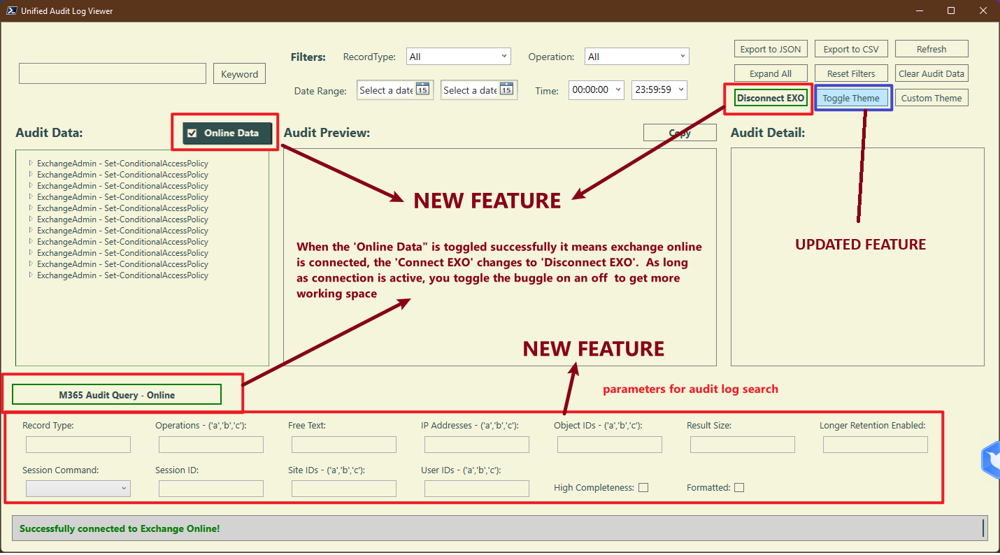

# Unified Audit Log Analyzer

## Table of Contents

- [Unified Audit Log Analyzer](#unified-audit-log-analyzer)
  - [Unified Audit Log Analyzer (GUI)](#unified-audit-log-analyzer-gui)
  - [Expand-UnifiedAuditLogReport (Non-GUI)](#expand-unifiedauditlogreport-non-gui)

## Unified Audit Log Analyzer (GUI) - Advanced Unified Audit Log Analyzer

The **Unified Audit Log Analyzer** is a powerful PowerShell-based graphical user interface (GUI) tool designed to help administrators analyze and visualize Microsoft 365 (M365) Unified Audit Logs. This tool provides a user-friendly interface for loading, filtering, and exporting audit log data in various formats (CSV, JSON). 

### Key Features

- Drag-and-drop functionality
- Advanced filtering capabilities
- Hierarchical data exploration
- Customizable themes
- **M365 Audit Query - Online Panel**: Directly search and analyze M365 audit logs within the tool.
- **Online Data Toggle**: Enable or disable the Online Data Retrieval Panel based on Exchange Online connection status.
- **Connect/Disconnect EXO**: Connect or disconnect from Exchange Online directly within the tool.
- **Toggle Theme and Custom Theme**: Choose from 10 pre-built themes or create a custom theme for the interface.

### Notes and Requirements

1. **PowerShell**: Ensure PowerShell 5.1 or later is installed which supports WPF

2. **Permissions**: Ensure that the account running the script has the necessary permissions to access the audit log data using the `Search-UnifiedAuditLog` cmdlet. For more information, refer to the [Microsoft documentation on Search-UnifiedAuditLog](https://learn.microsoft.com/en-us/powershell/module/exchange/search-unifiedauditlog?view=exchange-ps).
3. **Exchange Online Management**: Ensure that the Exchange Online Management PowerShell module is installed. For more information on installing and using the module, refer to the [Microsoft documentation](https://learn.microsoft.com/en-us/powershell/exchange/exchange-online-powershell-v2?view=exchange-ps).

### Running the Script

To run the script, follow these steps:

1. Open PowerShell and navigate to the directory containing the script.
2. There are two ways to execute the script:

#### Run the script without parameters:

```powershell
.\UnifiedAuditLogAnalyzer.ps1
```

#### Run the script with the `InputData` parameter:

- Using a file path:
  
```powershell
.\UnifiedAuditLogAnalyzer.ps1 -InputData "C:\AuditLogs\logdata.csv"
```

- Using an imported CSV file:

```powershell
$log = Import-Csv "C:\AuditLogs\logdata.csv"
.\UnifiedAuditLogAnalyzer.ps1 -InputData $log
```

- Getting from server using Search-Unified command:

```powershell
$log = search-UnifiedAuditLog -EndDate 3/3/2025 -StartDate 1/3/2025 -ResultSize 100
.\UnifiedAuditLogAnalyzer.ps1 -InputData $log
```

## Availability

- As script to run via powershell
- As EXE program file, portable.
- Check the release page to download

### Analyzer UI

{width=70%}

### New Features

#### 1. **M365 Audit Query - Online Panel**

- **Description**:
  - A new **Online Panel** has been added to enable direct unified audit log searches and analysis within the tool.
  - The start and end date/time are automatically retrieved from the filter panel.
  - All parameters from the `Search-UnifiedAuditLog` PowerShell cmdlet (as documented in the [Microsoft documentation](https://learn.microsoft.com/en-us/powershell/module/exchange/search-unifiedauditlog?view=exchange-ps)) have been integrated into the panel.
  - This feature allows users to retrieve and analyze M365 audit logs directly without needing to use the Microsoft 365 portal.

- **Benefits**:
  - Fine-tune your audit log searches with advanced parameters.
  - Streamline the process of retrieving and analyzing logs in one place.

#### 2. **Online Data Toggle**

- **Description**:
  - A new toggle has been added to enable or disable the **Online Data Retrieval Panel**.
  - If Exchange Online is connected, the panel will open automatically.
  - If Exchange Online is not connected, the panel will remain hidden.

- **Benefits**:
  - Provides flexibility to hide the online panel when not needed.
  - Improves usability by automatically adapting to the connection status.

#### 3. **Connect/Disconnect EXO**

- **Description**:
  - Added functionality to **Connect** or **Disconnect** from Exchange Online directly within the tool.
  - After connecting to Exchange Online, the **Online Panel** will open automatically.

- **Benefits**:
  - Simplifies the process of managing Exchange Online connections.
  - Enhances user experience by automating panel visibility based on connection status.

### Updated Features

#### **Toggle Theme and Custom Theme**

- **Description**:
  - The **Theme Toggle** feature has been updated to include **10 pre-built themes**.
  
    | Light Mode           | Dark Mode           |
    |-----------------------|---------------------|
    | High Contrast         | Custom Navy Theme   |
    | Solarized Light       | Solarized Dark      |
    | Monokai               | Dracula             |
    | One Dark              | Gruvbox Light       |
  
  - Updated the **Custom Theme** option, allowing users to select their preferred colors for the interface.
  - Theme changes now apply to all elements in the user interface, improving readability and visual consistency.

- **Benefits**:
  - Provides more customization options for users.
  - Enhances readability and user experience across the application.

## Screenshots

{ width=65% }

{ width=65% }

## Sample Blue Mode

{ width=65% }

### Bug Fixes

- Fixed an issue where the theme settings were not applying consistently across all UI elements.

### Known Issues

- Performance may be impacted when retrieving large volumes of audit logs online.
- Some users may experience delays when applying custom themes.


---

### For More Information

Refer to the detailed documentation:  [Advanced Unified Audit Log Analyzer](/Help/UnifiedAuditLogAnalyzerGUI.md)

---

## Expand-UnifiedAuditLogReport (Non-GUI) - Simplified Unified Audit Log Expander

If you do not want the GUI version, you can use the simplified script:

`Expand-UnifiedAuditLogReport` is a PowerShell script designed to process and analyze audit logs from Microsoft 365 Unified Audit Log data. It provides two ways to handle audit logs:

1. **Using locally stored audit logs**
2. **Retrieving audit data directly from Microsoft 365**

This script expands JSON-based audit log entries, extracts key parameters, and generates detailed reports for better analysis.

### Notes and Requirements

- Ensure you have the necessary permissions to retrieve Microsoft 365 audit logs.

- If using direct retrieval, ensure you are connected to Exchange Online by running `Connect-ExchangeOnline`.

- The script checks for missing prerequisites and provides guidance if Exchange Online Management is not installed.

#### Key features include:

- Supports processing audit logs from local files or direct retrieval from Microsoft 365.
- Converts JSON-based audit log data into a structured, readable format.
- Extracts and organizes key parameter information.
- Generates CSV reports for audit logs and modified properties.
- Supports filtering by audit record types, operations, date ranges, and free-text searches.
- Provides an option to prioritize completeness over performance.
- Enables session-based data retrieval to handle large datasets efficiently.

### Examples

#### Example 1: Retrieving Audit Logs Directly from Microsoft 365

```powershell
$UnifiedLogs = Search-UnifiedAuditLog -EndDate 3/15/2025 -StartDate 3/1/2025 -ResultSize 500 -RecordType ExchangeAdmin
Expand-UnifiedAuditLogReport -AuditLogs $UnifiedLogs -CreateAuditModifiedPropertyReport -ReportPath "C:\Reports\AuditReport.csv"
```

#### Example 2: Using Locally Stored Audit Logs

```powershell
$UnifiedLogs = Import-Csv "ExistingM365UnifiedAuditfile.csv"
Expand-UnifiedAuditLogReport -AuditLogs $UnifiedLogs -CreateAuditModifiedPropertyReport -ReportPath "C:\Reports\AuditReport.csv"
```

#### For More Information (Non GUI)

Refer to the detailed documentation:  [Simplified Unified Audit Log Expander](/Help/Expand-UnifiedAuditLogReport.md)

---

## License

This script is provided under the [MIT License](./License.md). 


## Contact

For additional support or feature requests

- please open an issue on the [GitHub repository](https://github.com/techjollof/M365UnifiedAuditLogAnalyzer).
- You can also reach me via techjollof@gmail.com. Follow me on [linkedIn](https://www.linkedin.com/in/ndtetteh/) 
